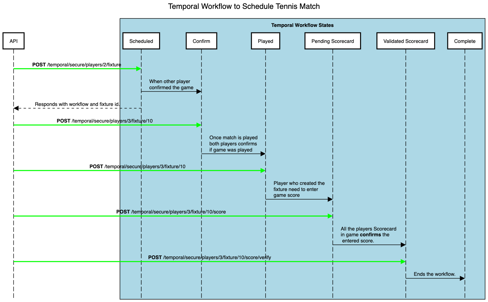
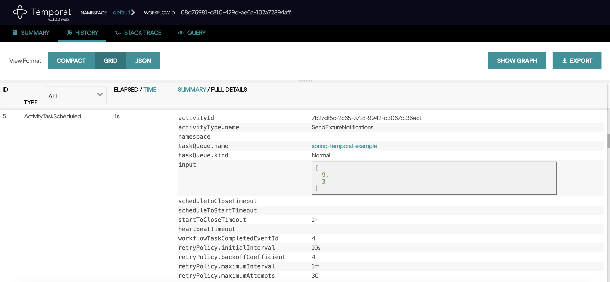

# spring-temporal
This example shows how we can use temporal workflow with Spring Boot JPA. We use Tennis game fixture as Describing temporal workflow in spring boot.

Below is the sequence diagram which highlights defferent states we track in temporal workflow.

<h4>Sequence Diagram </h4>

  
<h4>Set Up</h4>

To run this locally please run ***docker-compose up*** and you can check temporal server at http://localhost:8088/.

